# Analysation for stackoverflow-survey with python

## Introduction

we'll analyze the StackOverflow developer survey dataset. The dataset contains responses to an annual survey conducted by StackOverflow. You can find the raw data & official analysis here: https://insights.stackoverflow.com/survey.

### Importing Libraries
The libraries used in this notebook are:


```python
import pandas as pd
import numpy as np

import seaborn as sns
import matplotlib
import matplotlib.pyplot as plt
%matplotlib inline
```

Let's load the CSV files using the Pandas library. We'll use the name `survey_raw_df` for the data frame to indicate this is unprocessed data that we might clean, filter, and modify to prepare a data frame ready for analysis.


```python
survey_raw_df = pd.read_csv('survey_results_public.csv')
survey_raw_df
```


<div>
<style scoped>
    .dataframe tbody tr th:only-of-type {
        vertical-align: middle;
    }

    .dataframe tbody tr th {
        vertical-align: top;
    }

    .dataframe thead th {
        text-align: right;
    }
</style>
<table border="1" class="dataframe">
  <thead>
    <tr style="text-align: right;">
      <th></th>
      <th>Respondent</th>
      <th>MainBranch</th>
      <th>Hobbyist</th>
      <th>Age</th>
      <th>Age1stCode</th>
      <th>CompFreq</th>
      <th>CompTotal</th>
      <th>ConvertedComp</th>
      <th>Country</th>
      <th>CurrencyDesc</th>
      <th>...</th>
      <th>SurveyEase</th>
      <th>SurveyLength</th>
      <th>Trans</th>
      <th>UndergradMajor</th>
      <th>WebframeDesireNextYear</th>
      <th>WebframeWorkedWith</th>
      <th>WelcomeChange</th>
      <th>WorkWeekHrs</th>
      <th>YearsCode</th>
      <th>YearsCodePro</th>
    </tr>
  </thead>
  <tbody>
    <tr>
      <th>0</th>
      <td>1</td>
      <td>I am a developer by profession</td>
      <td>Yes</td>
      <td>NaN</td>
      <td>13</td>
      <td>Monthly</td>
      <td>NaN</td>
      <td>NaN</td>
      <td>Germany</td>
      <td>European Euro</td>
      <td>...</td>
      <td>Neither easy nor difficult</td>
      <td>Appropriate in length</td>
      <td>No</td>
      <td>Computer science, computer engineering, or sof...</td>
      <td>ASP.NET Core</td>
      <td>ASP.NET;ASP.NET Core</td>
      <td>Just as welcome now as I felt last year</td>
      <td>50.0</td>
      <td>36</td>
      <td>27</td>
    </tr>
    <tr>
      <th>1</th>
      <td>2</td>
      <td>I am a developer by profession</td>
      <td>No</td>
      <td>NaN</td>
      <td>19</td>
      <td>NaN</td>
      <td>NaN</td>
      <td>NaN</td>
      <td>United Kingdom</td>
      <td>Pound sterling</td>
      <td>...</td>
      <td>NaN</td>
      <td>NaN</td>
      <td>NaN</td>
      <td>Computer science, computer engineering, or sof...</td>
      <td>NaN</td>
      <td>NaN</td>
      <td>Somewhat more welcome now than last year</td>
      <td>NaN</td>
      <td>7</td>
      <td>4</td>
    </tr>
    <tr>
      <th>2</th>
      <td>3</td>
      <td>I code primarily as a hobby</td>
      <td>Yes</td>
      <td>NaN</td>
      <td>15</td>
      <td>NaN</td>
      <td>NaN</td>
      <td>NaN</td>
      <td>Russian Federation</td>
      <td>NaN</td>
      <td>...</td>
      <td>Neither easy nor difficult</td>
      <td>Appropriate in length</td>
      <td>NaN</td>
      <td>NaN</td>
      <td>NaN</td>
      <td>NaN</td>
      <td>Somewhat more welcome now than last year</td>
      <td>NaN</td>
      <td>4</td>
      <td>NaN</td>
    </tr>
    <tr>
      <th>3</th>
      <td>4</td>
      <td>I am a developer by profession</td>
      <td>Yes</td>
      <td>25.0</td>
      <td>18</td>
      <td>NaN</td>
      <td>NaN</td>
      <td>NaN</td>
      <td>Albania</td>
      <td>Albanian lek</td>
      <td>...</td>
      <td>NaN</td>
      <td>NaN</td>
      <td>No</td>
      <td>Computer science, computer engineering, or sof...</td>
      <td>NaN</td>
      <td>NaN</td>
      <td>Somewhat less welcome now than last year</td>
      <td>40.0</td>
      <td>7</td>
      <td>4</td>
    </tr>
    <tr>
      <th>4</th>
      <td>5</td>
      <td>I used to be a developer by profession, but no...</td>
      <td>Yes</td>
      <td>31.0</td>
      <td>16</td>
      <td>NaN</td>
      <td>NaN</td>
      <td>NaN</td>
      <td>United States</td>
      <td>NaN</td>
      <td>...</td>
      <td>Easy</td>
      <td>Too short</td>
      <td>No</td>
      <td>Computer science, computer engineering, or sof...</td>
      <td>Django;Ruby on Rails</td>
      <td>Ruby on Rails</td>
      <td>Just as welcome now as I felt last year</td>
      <td>NaN</td>
      <td>15</td>
      <td>8</td>
    </tr>
    <tr>
      <th>...</th>
      <td>...</td>
      <td>...</td>
      <td>...</td>
      <td>...</td>
      <td>...</td>
      <td>...</td>
      <td>...</td>
      <td>...</td>
      <td>...</td>
      <td>...</td>
      <td>...</td>
      <td>...</td>
      <td>...</td>
      <td>...</td>
      <td>...</td>
      <td>...</td>
      <td>...</td>
      <td>...</td>
      <td>...</td>
      <td>...</td>
      <td>...</td>
    </tr>
    <tr>
      <th>64456</th>
      <td>64858</td>
      <td>NaN</td>
      <td>Yes</td>
      <td>NaN</td>
      <td>16</td>
      <td>NaN</td>
      <td>NaN</td>
      <td>NaN</td>
      <td>United States</td>
      <td>NaN</td>
      <td>...</td>
      <td>NaN</td>
      <td>NaN</td>
      <td>NaN</td>
      <td>Computer science, computer engineering, or sof...</td>
      <td>NaN</td>
      <td>NaN</td>
      <td>NaN</td>
      <td>NaN</td>
      <td>10</td>
      <td>Less than 1 year</td>
    </tr>
    <tr>
      <th>64457</th>
      <td>64867</td>
      <td>NaN</td>
      <td>Yes</td>
      <td>NaN</td>
      <td>NaN</td>
      <td>NaN</td>
      <td>NaN</td>
      <td>NaN</td>
      <td>Morocco</td>
      <td>NaN</td>
      <td>...</td>
      <td>NaN</td>
      <td>NaN</td>
      <td>NaN</td>
      <td>NaN</td>
      <td>NaN</td>
      <td>NaN</td>
      <td>NaN</td>
      <td>NaN</td>
      <td>NaN</td>
      <td>NaN</td>
    </tr>
    <tr>
      <th>64458</th>
      <td>64898</td>
      <td>NaN</td>
      <td>Yes</td>
      <td>NaN</td>
      <td>NaN</td>
      <td>NaN</td>
      <td>NaN</td>
      <td>NaN</td>
      <td>Viet Nam</td>
      <td>NaN</td>
      <td>...</td>
      <td>NaN</td>
      <td>NaN</td>
      <td>NaN</td>
      <td>NaN</td>
      <td>NaN</td>
      <td>NaN</td>
      <td>NaN</td>
      <td>NaN</td>
      <td>NaN</td>
      <td>NaN</td>
    </tr>
    <tr>
      <th>64459</th>
      <td>64925</td>
      <td>NaN</td>
      <td>Yes</td>
      <td>NaN</td>
      <td>NaN</td>
      <td>NaN</td>
      <td>NaN</td>
      <td>NaN</td>
      <td>Poland</td>
      <td>NaN</td>
      <td>...</td>
      <td>NaN</td>
      <td>NaN</td>
      <td>NaN</td>
      <td>NaN</td>
      <td>Angular;Angular.js;React.js</td>
      <td>NaN</td>
      <td>NaN</td>
      <td>NaN</td>
      <td>NaN</td>
      <td>NaN</td>
    </tr>
    <tr>
      <th>64460</th>
      <td>65112</td>
      <td>NaN</td>
      <td>Yes</td>
      <td>NaN</td>
      <td>NaN</td>
      <td>NaN</td>
      <td>NaN</td>
      <td>NaN</td>
      <td>Spain</td>
      <td>NaN</td>
      <td>...</td>
      <td>NaN</td>
      <td>NaN</td>
      <td>NaN</td>
      <td>Computer science, computer engineering, or sof...</td>
      <td>ASP.NET Core;jQuery</td>
      <td>Angular;Angular.js;ASP.NET Core;jQuery</td>
      <td>NaN</td>
      <td>NaN</td>
      <td>NaN</td>
      <td>NaN</td>
    </tr>
  </tbody>
</table>
<p>64461 rows × 61 columns</p>
</div>


The dataset contains over 64,000 responses to 60 questions (although many questions are optional). The responses have been anonymized to remove personally identifiable information, and each respondent has been assigned a randomized respondent ID.

Let's view the list of columns in the data frame. 


```python
survey_raw_df.columns
```


    Index(['Respondent', 'MainBranch', 'Hobbyist', 'Age', 'Age1stCode', 'CompFreq',
           'CompTotal', 'ConvertedComp', 'Country', 'CurrencyDesc',
           'CurrencySymbol', 'DatabaseDesireNextYear', 'DatabaseWorkedWith',
           'DevType', 'EdLevel', 'Employment', 'Ethnicity', 'Gender', 'JobFactors',
           'JobSat', 'JobSeek', 'LanguageDesireNextYear', 'LanguageWorkedWith',
           'MiscTechDesireNextYear', 'MiscTechWorkedWith',
           'NEWCollabToolsDesireNextYear', 'NEWCollabToolsWorkedWith', 'NEWDevOps',
           'NEWDevOpsImpt', 'NEWEdImpt', 'NEWJobHunt', 'NEWJobHuntResearch',
           'NEWLearn', 'NEWOffTopic', 'NEWOnboardGood', 'NEWOtherComms',
           'NEWOvertime', 'NEWPurchaseResearch', 'NEWPurpleLink', 'NEWSOSites',
           'NEWStuck', 'OpSys', 'OrgSize', 'PlatformDesireNextYear',
           'PlatformWorkedWith', 'PurchaseWhat', 'Sexuality', 'SOAccount',
           'SOComm', 'SOPartFreq', 'SOVisitFreq', 'SurveyEase', 'SurveyLength',
           'Trans', 'UndergradMajor', 'WebframeDesireNextYear',
           'WebframeWorkedWith', 'WelcomeChange', 'WorkWeekHrs', 'YearsCode',
           'YearsCodePro'],
          dtype='object')


It appears that shortcodes for questions have been used as column names. 

We can refer to the schema file to see the full text of each question. The schema file contains only two columns: `Column` and `QuestionText`. We can load it as Pandas Series with `Column` as the index and the  `QuestionText` as the value.


```python
survey_re_schema = pd.read_csv('survey_results_schema.csv', index_col='Column')
survey_re_schema
```


<div>
<style scoped>
    .dataframe tbody tr th:only-of-type {
        vertical-align: middle;
    }

    .dataframe tbody tr th {
        vertical-align: top;
    }

    .dataframe thead th {
        text-align: right;
    }
</style>
<table border="1" class="dataframe">
  <thead>
    <tr style="text-align: right;">
      <th></th>
      <th>QuestionText</th>
    </tr>
    <tr>
      <th>Column</th>
      <th></th>
    </tr>
  </thead>
  <tbody>
    <tr>
      <th>Respondent</th>
      <td>Randomized respondent ID number (not in order ...</td>
    </tr>
    <tr>
      <th>MainBranch</th>
      <td>Which of the following options best describes ...</td>
    </tr>
    <tr>
      <th>Hobbyist</th>
      <td>Do you code as a hobby?</td>
    </tr>
    <tr>
      <th>Age</th>
      <td>What is your age (in years)? If you prefer not...</td>
    </tr>
    <tr>
      <th>Age1stCode</th>
      <td>At what age did you write your first line of c...</td>
    </tr>
    <tr>
      <th>...</th>
      <td>...</td>
    </tr>
    <tr>
      <th>WebframeWorkedWith</th>
      <td>Which web frameworks have you done extensive d...</td>
    </tr>
    <tr>
      <th>WelcomeChange</th>
      <td>Compared to last year, how welcome do you feel...</td>
    </tr>
    <tr>
      <th>WorkWeekHrs</th>
      <td>On average, how many hours per week do you wor...</td>
    </tr>
    <tr>
      <th>YearsCode</th>
      <td>Including any education, how many years have y...</td>
    </tr>
    <tr>
      <th>YearsCodePro</th>
      <td>NOT including education, how many years have y...</td>
    </tr>
  </tbody>
</table>
<p>61 rows × 1 columns</p>
</div>


```python
schema_raw = survey_re_schema.QuestionText
schema_raw
```


    Column
    Respondent            Randomized respondent ID number (not in order ...
    MainBranch            Which of the following options best describes ...
    Hobbyist                                        Do you code as a hobby?
    Age                   What is your age (in years)? If you prefer not...
    Age1stCode            At what age did you write your first line of c...
                                                ...                        
    WebframeWorkedWith    Which web frameworks have you done extensive d...
    WelcomeChange         Compared to last year, how welcome do you feel...
    WorkWeekHrs           On average, how many hours per week do you wor...
    YearsCode             Including any education, how many years have y...
    YearsCodePro          NOT including education, how many years have y...
    Name: QuestionText, Length: 61, dtype: object


We can now use schema_raw to retrieve the full question text for any column in survey_raw_df.


```python
schema_raw['YearsCodePro']
```


    'NOT including education, how many years have you coded professionally (as a part of your work)?'


We've now loaded the dataset. We're ready to move on to the next step of preprocessing & cleaning the data for our analysis.

## Data Preparation & Cleaning

While the survey responses contain a wealth of information, we'll limit our analysis to the following areas:

- Demographics of the survey respondents and the global programming community
- Distribution of programming skills, experience, and preferences
- Employment-related information, preferences, and opinions

Let's select a subset of columns with the relevant data for our analysis.


```python
selected_columns = [
    # Demographics
    'Country',
    'Age',
    'Gender',
    'EdLevel',
    'UndergradMajor',
    # Programming experience
    'Hobbyist',
    'Age1stCode',
    'YearsCode',
    'YearsCodePro',
    'LanguageWorkedWith',
    'LanguageDesireNextYear',
    'NEWLearn',
    'NEWStuck',
    # Employment
    'Employment',
    'DevType',
    'WorkWeekHrs',
    'JobSat',
    'JobFactors',
    'NEWOvertime',
    'NEWEdImpt'
]
```


```python
len(selected_columns)
```


    20


Let's extract a copy of the data from these columns into a new data frame survey_df. We can continue to modify further without affecting the original data frame.


```python
survey_df = survey_raw_df[selected_columns].copy()
```


```python
schema = schema_raw[selected_columns]
```

Let's view some basic information about the data frame.


```python
survey_df.shape
```


    (64461, 20)


```python
survey_df.info()
```

    <class 'pandas.core.frame.DataFrame'>
    RangeIndex: 64461 entries, 0 to 64460
    Data columns (total 20 columns):
     #   Column                  Non-Null Count  Dtype  
    ---  ------                  --------------  -----  
     0   Country                 64072 non-null  object 
     1   Age                     45446 non-null  float64
     2   Gender                  50557 non-null  object 
     3   EdLevel                 57431 non-null  object 
     4   UndergradMajor          50995 non-null  object 
     5   Hobbyist                64416 non-null  object 
     6   Age1stCode              57900 non-null  object 
     7   YearsCode               57684 non-null  object 
     8   YearsCodePro            46349 non-null  object 
     9   LanguageWorkedWith      57378 non-null  object 
     10  LanguageDesireNextYear  54113 non-null  object 
     11  NEWLearn                56156 non-null  object 
     12  NEWStuck                54983 non-null  object 
     13  Employment              63854 non-null  object 
     14  DevType                 49370 non-null  object 
     15  WorkWeekHrs             41151 non-null  float64
     16  JobSat                  45194 non-null  object 
     17  JobFactors              49349 non-null  object 
     18  NEWOvertime             43231 non-null  object 
     19  NEWEdImpt               48465 non-null  object 
    dtypes: float64(2), object(18)
    memory usage: 9.8+ MB


Most columns have the data type object, either because they contain values of different types or contain empty values (NaN). It appears that every column contains some empty values since the Non-Null count for every column is lower than the total number of rows (64461). We'll need to deal with empty values and manually adjust the data type for each column on a case-by-case basis.

Only two of the columns were detected as numeric columns (Age and WorkWeekHrs), even though a few other columns have mostly numeric values. To make our analysis easier, let's convert some other columns into numeric data types while ignoring any non-numeric value. The non-numeric are converted to NaN.


```python
survey_df['Age1stCode'] = pd.to_numeric(survey_df.Age1stCode, errors='coerce')
survey_df['YearsCode'] = pd.to_numeric(survey_df.YearsCode, errors='coerce')
survey_df['YearsCodePro'] = pd.to_numeric(survey_df.YearsCodePro, errors='coerce')
```

Let's now view some basic statistics about numeric columns.


```python
survey_df.describe()
```


<div>
<style scoped>
    .dataframe tbody tr th:only-of-type {
        vertical-align: middle;
    }

    .dataframe tbody tr th {
        vertical-align: top;
    }

    .dataframe thead th {
        text-align: right;
    }
</style>
<table border="1" class="dataframe">
  <thead>
    <tr style="text-align: right;">
      <th></th>
      <th>Age</th>
      <th>Age1stCode</th>
      <th>YearsCode</th>
      <th>YearsCodePro</th>
      <th>WorkWeekHrs</th>
    </tr>
  </thead>
  <tbody>
    <tr>
      <th>count</th>
      <td>45446.000000</td>
      <td>57473.000000</td>
      <td>56784.000000</td>
      <td>44133.000000</td>
      <td>41151.000000</td>
    </tr>
    <tr>
      <th>mean</th>
      <td>30.834111</td>
      <td>15.476572</td>
      <td>12.782051</td>
      <td>8.869667</td>
      <td>40.782174</td>
    </tr>
    <tr>
      <th>std</th>
      <td>9.585392</td>
      <td>5.114081</td>
      <td>9.490657</td>
      <td>7.759961</td>
      <td>17.816383</td>
    </tr>
    <tr>
      <th>min</th>
      <td>1.000000</td>
      <td>5.000000</td>
      <td>1.000000</td>
      <td>1.000000</td>
      <td>1.000000</td>
    </tr>
    <tr>
      <th>25%</th>
      <td>24.000000</td>
      <td>12.000000</td>
      <td>6.000000</td>
      <td>3.000000</td>
      <td>40.000000</td>
    </tr>
    <tr>
      <th>50%</th>
      <td>29.000000</td>
      <td>15.000000</td>
      <td>10.000000</td>
      <td>6.000000</td>
      <td>40.000000</td>
    </tr>
    <tr>
      <th>75%</th>
      <td>35.000000</td>
      <td>18.000000</td>
      <td>17.000000</td>
      <td>12.000000</td>
      <td>44.000000</td>
    </tr>
    <tr>
      <th>max</th>
      <td>279.000000</td>
      <td>85.000000</td>
      <td>50.000000</td>
      <td>50.000000</td>
      <td>475.000000</td>
    </tr>
  </tbody>
</table>
</div>


There seems to be a problem with the age column, as the minimum value is 1 and the maximum is 279. This is a common issue with surveys: responses may contain invalid values due to accidental or intentional errors while responding. A simple fix would be to ignore the rows where the age is higher than 90 years or lower than 10 years as invalid survey responses. We can do this using the .drop method


```python
survey_df.drop(survey_df[survey_df.Age < 10].index, inplace=True)
survey_df.drop(survey_df[survey_df.Age > 90].index, inplace=True)
```

The same holds for WorkWeekHrs. Let's ignore entries where the value for the column is higher than 140 hours. (~20 hours per day).


```python
survey_df.drop(survey_df[survey_df.WorkWeekHrs > 140].index, inplace=True)
```


```python
survey_df.describe()
```


<div>
<style scoped>
    .dataframe tbody tr th:only-of-type {
        vertical-align: middle;
    }

    .dataframe tbody tr th {
        vertical-align: top;
    }

    .dataframe thead th {
        text-align: right;
    }
</style>
<table border="1" class="dataframe">
  <thead>
    <tr style="text-align: right;">
      <th></th>
      <th>Age</th>
      <th>Age1stCode</th>
      <th>YearsCode</th>
      <th>YearsCodePro</th>
      <th>WorkWeekHrs</th>
    </tr>
  </thead>
  <tbody>
    <tr>
      <th>count</th>
      <td>45304.000000</td>
      <td>57315.000000</td>
      <td>56625.000000</td>
      <td>43987.000000</td>
      <td>40995.000000</td>
    </tr>
    <tr>
      <th>mean</th>
      <td>30.810193</td>
      <td>15.475635</td>
      <td>12.784336</td>
      <td>8.873099</td>
      <td>40.024497</td>
    </tr>
    <tr>
      <th>std</th>
      <td>9.429350</td>
      <td>5.115102</td>
      <td>9.494409</td>
      <td>7.762089</td>
      <td>10.628110</td>
    </tr>
    <tr>
      <th>min</th>
      <td>10.000000</td>
      <td>5.000000</td>
      <td>1.000000</td>
      <td>1.000000</td>
      <td>1.000000</td>
    </tr>
    <tr>
      <th>25%</th>
      <td>24.000000</td>
      <td>12.000000</td>
      <td>6.000000</td>
      <td>3.000000</td>
      <td>40.000000</td>
    </tr>
    <tr>
      <th>50%</th>
      <td>29.000000</td>
      <td>15.000000</td>
      <td>10.000000</td>
      <td>6.000000</td>
      <td>40.000000</td>
    </tr>
    <tr>
      <th>75%</th>
      <td>35.000000</td>
      <td>18.000000</td>
      <td>17.000000</td>
      <td>12.000000</td>
      <td>43.000000</td>
    </tr>
    <tr>
      <th>max</th>
      <td>89.000000</td>
      <td>85.000000</td>
      <td>50.000000</td>
      <td>50.000000</td>
      <td>140.000000</td>
    </tr>
  </tbody>
</table>
</div>


The gender column also allows for picking multiple options. We'll remove values containing more than one option to simplify our analysis.


```python
survey_df.Gender.value_counts()
```


    Man                                                            45891
    Woman                                                           3833
    Non-binary, genderqueer, or gender non-conforming                382
    Man;Non-binary, genderqueer, or gender non-conforming            121
    Woman;Non-binary, genderqueer, or gender non-conforming           92
    Woman;Man                                                         73
    Woman;Man;Non-binary, genderqueer, or gender non-conforming       23
    Name: Gender, dtype: int64


```python
survey_df.where(~(survey_df.Gender.str.contains(';', na=False)), np.nan, inplace=True)
```


```python
survey_df.Gender.value_counts()
```


    Man                                                  45891
    Woman                                                 3833
    Non-binary, genderqueer, or gender non-conforming      382
    Name: Gender, dtype: int64


We've now cleaned up and prepared the dataset for analysis. Let's take a look at a sample of rows from the data frame.


```python
survey_df.sample(10)
```


<div>
<style scoped>
    .dataframe tbody tr th:only-of-type {
        vertical-align: middle;
    }

    .dataframe tbody tr th {
        vertical-align: top;
    }

    .dataframe thead th {
        text-align: right;
    }
</style>
<table border="1" class="dataframe">
  <thead>
    <tr style="text-align: right;">
      <th></th>
      <th>Country</th>
      <th>Age</th>
      <th>Gender</th>
      <th>EdLevel</th>
      <th>UndergradMajor</th>
      <th>Hobbyist</th>
      <th>Age1stCode</th>
      <th>YearsCode</th>
      <th>YearsCodePro</th>
      <th>LanguageWorkedWith</th>
      <th>LanguageDesireNextYear</th>
      <th>NEWLearn</th>
      <th>NEWStuck</th>
      <th>Employment</th>
      <th>DevType</th>
      <th>WorkWeekHrs</th>
      <th>JobSat</th>
      <th>JobFactors</th>
      <th>NEWOvertime</th>
      <th>NEWEdImpt</th>
    </tr>
  </thead>
  <tbody>
    <tr>
      <th>29326</th>
      <td>Switzerland</td>
      <td>39.0</td>
      <td>Man</td>
      <td>Master’s degree (M.A., M.S., M.Eng., MBA, etc.)</td>
      <td>Computer science, computer engineering, or sof...</td>
      <td>No</td>
      <td>33.0</td>
      <td>4.0</td>
      <td>1.0</td>
      <td>Bash/Shell/PowerShell;Java;SQL</td>
      <td>Bash/Shell/PowerShell;Java;Python;Rust;SQL</td>
      <td>Once a year</td>
      <td>Call a coworker or friend;Visit Stack Overflow...</td>
      <td>Employed full-time</td>
      <td>Developer, back-end</td>
      <td>42.0</td>
      <td>Slightly satisfied</td>
      <td>Diversity of the company or organization;Langu...</td>
      <td>Sometimes: 1-2 days per month but less than we...</td>
      <td>Critically important</td>
    </tr>
    <tr>
      <th>28044</th>
      <td>United States</td>
      <td>33.0</td>
      <td>Man</td>
      <td>Bachelor’s degree (B.A., B.S., B.Eng., etc.)</td>
      <td>A humanities discipline (such as literature, h...</td>
      <td>Yes</td>
      <td>27.0</td>
      <td>6.0</td>
      <td>2.0</td>
      <td>HTML/CSS;JavaScript;Python;SQL;TypeScript</td>
      <td>Swift</td>
      <td>Once every few years</td>
      <td>Call a coworker or friend;Visit Stack Overflow...</td>
      <td>Employed full-time</td>
      <td>Developer, front-end;Developer, full-stack;Dev...</td>
      <td>41.0</td>
      <td>Very dissatisfied</td>
      <td>Flex time or a flexible schedule;Languages, fr...</td>
      <td>Rarely: 1-2 days per year or less</td>
      <td>Fairly important</td>
    </tr>
    <tr>
      <th>24261</th>
      <td>United States</td>
      <td>37.0</td>
      <td>Man</td>
      <td>Bachelor’s degree (B.A., B.S., B.Eng., etc.)</td>
      <td>A humanities discipline (such as literature, h...</td>
      <td>Yes</td>
      <td>33.0</td>
      <td>4.0</td>
      <td>3.0</td>
      <td>HTML/CSS;Java;JavaScript;SQL</td>
      <td>JavaScript;Python;TypeScript</td>
      <td>Once a year</td>
      <td>Meditate;Call a coworker or friend;Visit Stack...</td>
      <td>Employed full-time</td>
      <td>Developer, back-end;Developer, front-end;Devel...</td>
      <td>35.0</td>
      <td>Very satisfied</td>
      <td>Flex time or a flexible schedule;Office enviro...</td>
      <td>Sometimes: 1-2 days per month but less than we...</td>
      <td>Not at all important/not necessary</td>
    </tr>
    <tr>
      <th>27715</th>
      <td>Germany</td>
      <td>37.0</td>
      <td>Man</td>
      <td>Master’s degree (M.A., M.S., M.Eng., MBA, etc.)</td>
      <td>Computer science, computer engineering, or sof...</td>
      <td>Yes</td>
      <td>17.0</td>
      <td>16.0</td>
      <td>9.0</td>
      <td>Bash/Shell/PowerShell;C;C#;Java;JavaScript;Obj...</td>
      <td>Rust;TypeScript</td>
      <td>Once a year</td>
      <td>Visit Stack Overflow;Watch help / tutorial vid...</td>
      <td>Employed full-time</td>
      <td>Developer, desktop or enterprise applications;...</td>
      <td>40.0</td>
      <td>Slightly dissatisfied</td>
      <td>NaN</td>
      <td>Sometimes: 1-2 days per month but less than we...</td>
      <td>Very important</td>
    </tr>
    <tr>
      <th>20230</th>
      <td>United States</td>
      <td>15.0</td>
      <td>Man</td>
      <td>Secondary school (e.g. American high school, G...</td>
      <td>NaN</td>
      <td>Yes</td>
      <td>9.0</td>
      <td>7.0</td>
      <td>3.0</td>
      <td>Bash/Shell/PowerShell;C;C++;Dart;HTML/CSS;Java...</td>
      <td>C;C++;Dart;Java;JavaScript;Kotlin;SQL;Swift</td>
      <td>Every few months</td>
      <td>Call a coworker or friend;Visit Stack Overflow...</td>
      <td>Independent contractor, freelancer, or self-em...</td>
      <td>Database administrator;Designer;Developer, bac...</td>
      <td>25.0</td>
      <td>Slightly satisfied</td>
      <td>Languages, frameworks, and other technologies ...</td>
      <td>Never</td>
      <td>Fairly important</td>
    </tr>
    <tr>
      <th>8387</th>
      <td>Lithuania</td>
      <td>29.0</td>
      <td>Man</td>
      <td>Bachelor’s degree (B.A., B.S., B.Eng., etc.)</td>
      <td>Information systems, information technology, o...</td>
      <td>Yes</td>
      <td>20.0</td>
      <td>2.0</td>
      <td>4.0</td>
      <td>Bash/Shell/PowerShell;HTML/CSS;Python</td>
      <td>C</td>
      <td>Once a year</td>
      <td>Play games;Visit Stack Overflow;Go for a walk ...</td>
      <td>Independent contractor, freelancer, or self-em...</td>
      <td>Developer, back-end;Developer, front-end;Devel...</td>
      <td>50.0</td>
      <td>Slightly satisfied</td>
      <td>Languages, frameworks, and other technologies ...</td>
      <td>Often: 1-2 days per week or more</td>
      <td>Somewhat important</td>
    </tr>
    <tr>
      <th>40096</th>
      <td>Sweden</td>
      <td>NaN</td>
      <td>NaN</td>
      <td>NaN</td>
      <td>NaN</td>
      <td>Yes</td>
      <td>NaN</td>
      <td>NaN</td>
      <td>NaN</td>
      <td>C;C#;Java;JavaScript</td>
      <td>JavaScript;Rust;Scala;TypeScript</td>
      <td>Every few months</td>
      <td>NaN</td>
      <td>Employed full-time</td>
      <td>NaN</td>
      <td>NaN</td>
      <td>NaN</td>
      <td>NaN</td>
      <td>NaN</td>
      <td>NaN</td>
    </tr>
    <tr>
      <th>2318</th>
      <td>Ukraine</td>
      <td>27.0</td>
      <td>Man</td>
      <td>Master’s degree (M.A., M.S., M.Eng., MBA, etc.)</td>
      <td>Computer science, computer engineering, or sof...</td>
      <td>Yes</td>
      <td>11.0</td>
      <td>6.0</td>
      <td>4.0</td>
      <td>HTML/CSS;Java;Kotlin</td>
      <td>C#;Kotlin</td>
      <td>Once a year</td>
      <td>Play games;Visit Stack Overflow;Go for a walk ...</td>
      <td>Employed full-time</td>
      <td>Developer, mobile</td>
      <td>40.0</td>
      <td>Slightly satisfied</td>
      <td>Flex time or a flexible schedule;Languages, fr...</td>
      <td>Sometimes: 1-2 days per month but less than we...</td>
      <td>Fairly important</td>
    </tr>
    <tr>
      <th>25393</th>
      <td>India</td>
      <td>23.0</td>
      <td>Man</td>
      <td>Master’s degree (M.A., M.S., M.Eng., MBA, etc.)</td>
      <td>Computer science, computer engineering, or sof...</td>
      <td>Yes</td>
      <td>17.0</td>
      <td>5.0</td>
      <td>NaN</td>
      <td>C;C++;Python</td>
      <td>C++;Python</td>
      <td>Once a year</td>
      <td>Meditate;Call a coworker or friend;Visit Stack...</td>
      <td>Student</td>
      <td>NaN</td>
      <td>NaN</td>
      <td>NaN</td>
      <td>Languages, frameworks, and other technologies ...</td>
      <td>NaN</td>
      <td>NaN</td>
    </tr>
    <tr>
      <th>41107</th>
      <td>United Kingdom</td>
      <td>NaN</td>
      <td>NaN</td>
      <td>NaN</td>
      <td>NaN</td>
      <td>Yes</td>
      <td>NaN</td>
      <td>NaN</td>
      <td>NaN</td>
      <td>Assembly;C</td>
      <td>Assembly;C</td>
      <td>Once a year</td>
      <td>NaN</td>
      <td>Employed full-time</td>
      <td>NaN</td>
      <td>NaN</td>
      <td>NaN</td>
      <td>NaN</td>
      <td>NaN</td>
      <td>NaN</td>
    </tr>
  </tbody>
</table>
</div>


## Exploratory Analysis and Visualization

Before we ask questions about the survey responses, it would help to understand the respondents' demographics, i.e., country, age, gender, education level, employment level, etc. It's essential to explore these variables to understand how representative the survey is of the worldwide programming community.

Let us start by setting up some parameters for the plots that we are going to create


```python
sns.set_style('darkgrid')
matplotlib.rcParams['font.size'] = 14
matplotlib.rcParams['figure.figsize'] = (13, 8)
matplotlib.rcParams['figure.facecolor'] = '#00000000'
```

### Country

Let's look at the number of countries from which there are responses in the survey and plot the ten countries with the highest number of responses.


```python
schema.Country
```


    'Where do you live?'


```python
survey_df.Country.nunique()
```


    183


We can identify the countries with the highest number of respondents using the value_counts method.


```python
top_countries = survey_df.Country.value_counts().head(15)
top_countries
```


    United States         12370
    India                  8360
    United Kingdom         3880
    Germany                3864
    Canada                 2174
    France                 1884
    Brazil                 1804
    Netherlands            1332
    Poland                 1259
    Australia              1199
    Spain                  1157
    Italy                  1115
    Russian Federation     1085
    Sweden                  879
    Pakistan                802
    Name: Country, dtype: int64


We can visualize this information using a bar chart.


```python
plt.xticks(rotation=75)
plt.title(schema.Country)
sns.barplot(x=top_countries.index, y=top_countries);
```


    
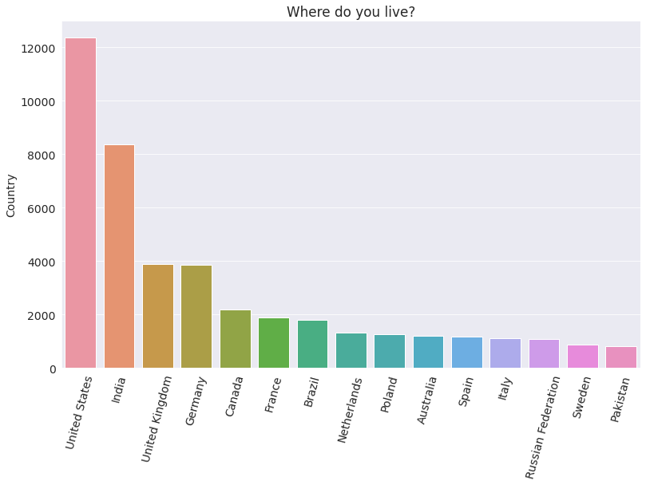
    


It appears that a disproportionately high number of respondents are from the US and India, probably because the survey is in English, and these countries have the highest English-speaking populations. We can already see that the survey may not be representative of the global programming community - especially from non-English speaking countries. Programmers from non-English speaking countries are almost certainly underrepresented.

### Age

The distribution of respondents' age is another crucial factor to look at. We can use a histogram to visualize it. 


```python
plt.title(schema.Age)
plt.xlabel('Age')
plt.ylabel('Number of respondents')
plt.hist(survey_df.Age, bins=np.arange(10, 90, 5));
```


    
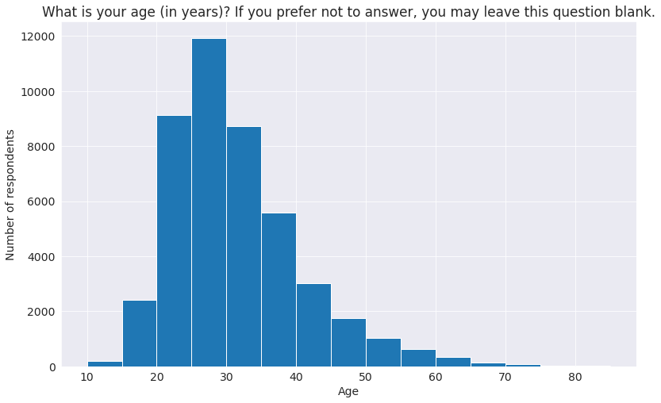
    


It appears that a large percentage of respondents are 20-45 years old. It's somewhat representative of the programming community in general. Many young people have taken up computer science as their field of study or profession in the last 20 years.

### Gender

Let's look at the distribution of responses for the Gender. It's a well-known fact that women and non-binary genders are underrepresented in the programming community, so we might expect to see a skewed distribution here.


```python
schema.Gender
```


    'Which of the following describe you, if any? Please check all that apply. If you prefer not to answer, you may leave this question blank.'


```python
gender_counts = survey_df.Gender.value_counts()
gender_counts
```


    Man                                                  45891
    Woman                                                 3833
    Non-binary, genderqueer, or gender non-conforming      382
    Name: Gender, dtype: int64


A pie chart would be a great way to visualize the distribution.


```python
plt.pie(gender_counts, labels=gender_counts.index, autopct='%1.1f%%', startangle=180)
plt.title(schema.Gender)
```


    Text(0.5, 1.0, 'Which of the following describe you, if any? Please check all that apply. If you prefer not to answer, you may leave this question blank.')


    
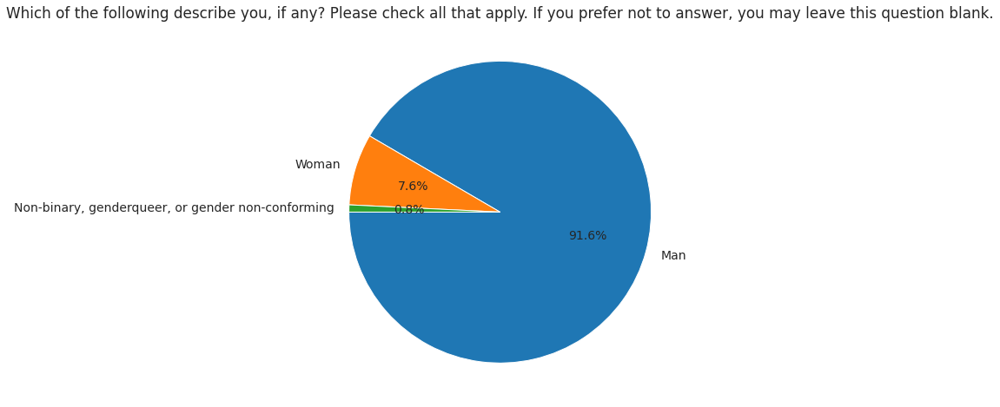
    


Only about 8% of survey respondents who have answered the question identify as women or non-binary. This number is lower than the overall percentage of women & non-binary genders in the programming community - which is estimated to be around 12%. 

### Education Level

Formal education in computer science is often considered an essential requirement for becoming a programmer. However, there are many free resources & tutorials available online to learn programming. Let's compare the education levels of respondents to gain some insight into this. We'll use a horizontal bar plot here.


```python
Ed_pct = survey_df.EdLevel.value_counts() * 100 / survey_df.EdLevel.count()
sns.barplot(x=Ed_pct, y=Ed_pct.index)
plt.title(schema['EdLevel'])
plt.ylabel(None);
```


    
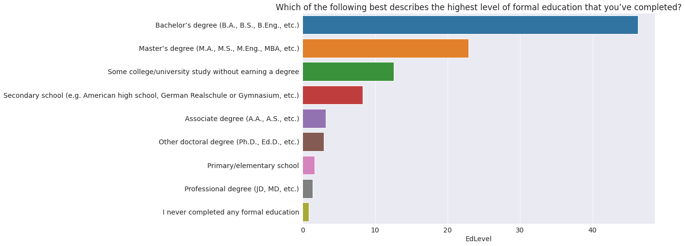
    


It appears that well over half of the respondents hold a bachelor's or master's degree, so most programmers seem to have some college education. However, it's not clear from this graph alone if they hold a degree in computer science.

Let's also plot undergraduate majors, but this time we'll convert the numbers into percentages and sort the values to make it easier to visualize the order.


```python
schema.UndergradMajor
```


    'What was your primary field of study?'


```python
UnderM_pct = survey_df.UndergradMajor.value_counts () * 100 / survey_df.UndergradMajor.count()
sns.barplot(x=UnderM_pct, y=UnderM_pct.index)

plt.title(schema.UndergradMajor)
plt.ylabel(None);
plt.xlabel('Percentage');
```


    
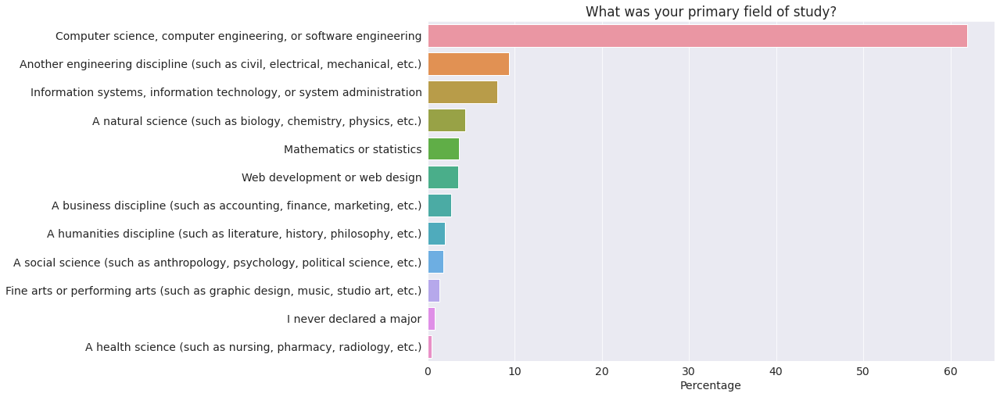
    


It turns out that 40% of programmers holding a college degree have a field of study other than computer science - which is very encouraging. It seems to suggest that while a college education is helpful in general, you do not need to pursue a major in computer science to become a successful programmer.

### Employment

Freelancing or contract work is a common choice among programmers, so it would be interesting to compare the breakdown between full-time, part-time, and freelance work. Let's visualize the data from the `Employment` column.


```python
schema.Employment
```


    'Which of the following best describes your current employment status?'


```python
(survey_df.Employment.value_counts(normalize=True, ascending=True)*100.).plot(kind='barh')
plt.title(schema.Employment)
plt.xlabel('Percentage');
```


    
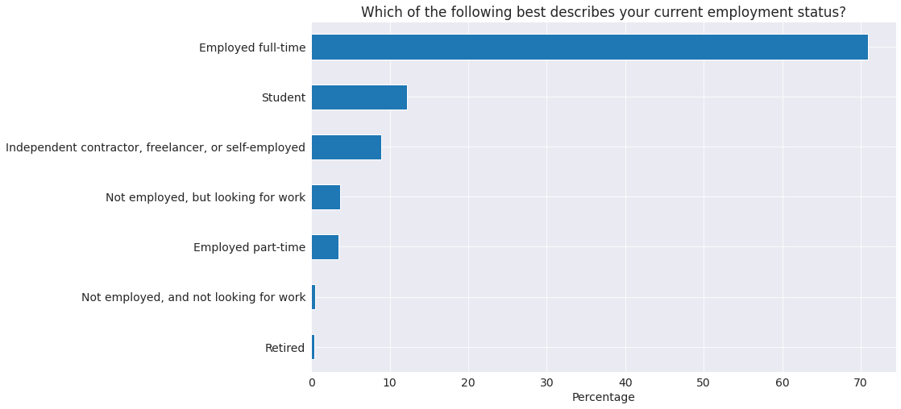
    


It appears that close to 10% of respondents are employed part time or as freelancers.

The DevType field contains information about the roles held by respondents. Since the question allows multiple answers, the column contains lists of values separated by a semi-colon ;, making it a bit harder to analyze directly.


```python
schema.DevType
```


    'Which of the following describe you? Please select all that apply.'


```python
survey_df.DevType.value_counts()
```


    Developer, full-stack                                                                                                                                                           4395
    Developer, back-end                                                                                                                                                             3056
    Developer, back-end;Developer, front-end;Developer, full-stack                                                                                                                  2214
    Developer, back-end;Developer, full-stack                                                                                                                                       1465
    Developer, front-end                                                                                                                                                            1390
                                                                                                                                                                                    ... 
    Database administrator;Developer, back-end;Developer, front-end;Developer, full-stack;Developer, QA or test;Senior executive/VP                                                    1
    Database administrator;Developer, back-end;Developer, front-end;Developer, full-stack;Product manager;Senior executive/VP                                                          1
    Developer, back-end;Developer, full-stack;Developer, mobile;DevOps specialist;Educator;System administrator                                                                        1
    Data or business analyst;Database administrator;Developer, back-end;Developer, desktop or enterprise applications;Developer, front-end;Developer, mobile;Engineering manager       1
    Data or business analyst;Developer, mobile;Senior executive/VP;System administrator                                                                                                1
    Name: DevType, Length: 8212, dtype: int64


Let's define a helper function that turns a column containing lists of values (like survey_df.DevType) into a data frame with one column for each possible option.


```python
def split_multicolumn(col_series):
    result_df = col_series.to_frame()
    options = []
    # Iterate over the column
    for idx, value  in col_series[col_series.notnull()].iteritems():
        # Break each value into list of options
        for option in value.split(';'):
            # Add the option as a column to result
            if not option in result_df.columns:
                options.append(option)
                result_df[option] = False
            # Mark the value in the option column as True
            result_df.at[idx, option] = True
    return result_df[options] 
```


```python
dev_type_df = split_multicolumn(survey_df.DevType)
dev_type_df
```


<div>
<style scoped>
    .dataframe tbody tr th:only-of-type {
        vertical-align: middle;
    }

    .dataframe tbody tr th {
        vertical-align: top;
    }

    .dataframe thead th {
        text-align: right;
    }
</style>
<table border="1" class="dataframe">
  <thead>
    <tr style="text-align: right;">
      <th></th>
      <th>Developer, desktop or enterprise applications</th>
      <th>Developer, full-stack</th>
      <th>Developer, mobile</th>
      <th>Designer</th>
      <th>Developer, front-end</th>
      <th>Developer, back-end</th>
      <th>Developer, QA or test</th>
      <th>DevOps specialist</th>
      <th>Developer, game or graphics</th>
      <th>Database administrator</th>
      <th>...</th>
      <th>System administrator</th>
      <th>Engineering manager</th>
      <th>Product manager</th>
      <th>Data or business analyst</th>
      <th>Academic researcher</th>
      <th>Data scientist or machine learning specialist</th>
      <th>Scientist</th>
      <th>Senior executive/VP</th>
      <th>Engineer, site reliability</th>
      <th>Marketing or sales professional</th>
    </tr>
  </thead>
  <tbody>
    <tr>
      <th>0</th>
      <td>True</td>
      <td>True</td>
      <td>False</td>
      <td>False</td>
      <td>False</td>
      <td>False</td>
      <td>False</td>
      <td>False</td>
      <td>False</td>
      <td>False</td>
      <td>...</td>
      <td>False</td>
      <td>False</td>
      <td>False</td>
      <td>False</td>
      <td>False</td>
      <td>False</td>
      <td>False</td>
      <td>False</td>
      <td>False</td>
      <td>False</td>
    </tr>
    <tr>
      <th>1</th>
      <td>False</td>
      <td>True</td>
      <td>True</td>
      <td>False</td>
      <td>False</td>
      <td>False</td>
      <td>False</td>
      <td>False</td>
      <td>False</td>
      <td>False</td>
      <td>...</td>
      <td>False</td>
      <td>False</td>
      <td>False</td>
      <td>False</td>
      <td>False</td>
      <td>False</td>
      <td>False</td>
      <td>False</td>
      <td>False</td>
      <td>False</td>
    </tr>
    <tr>
      <th>2</th>
      <td>False</td>
      <td>False</td>
      <td>False</td>
      <td>False</td>
      <td>False</td>
      <td>False</td>
      <td>False</td>
      <td>False</td>
      <td>False</td>
      <td>False</td>
      <td>...</td>
      <td>False</td>
      <td>False</td>
      <td>False</td>
      <td>False</td>
      <td>False</td>
      <td>False</td>
      <td>False</td>
      <td>False</td>
      <td>False</td>
      <td>False</td>
    </tr>
    <tr>
      <th>3</th>
      <td>False</td>
      <td>False</td>
      <td>False</td>
      <td>False</td>
      <td>False</td>
      <td>False</td>
      <td>False</td>
      <td>False</td>
      <td>False</td>
      <td>False</td>
      <td>...</td>
      <td>False</td>
      <td>False</td>
      <td>False</td>
      <td>False</td>
      <td>False</td>
      <td>False</td>
      <td>False</td>
      <td>False</td>
      <td>False</td>
      <td>False</td>
    </tr>
    <tr>
      <th>4</th>
      <td>False</td>
      <td>False</td>
      <td>False</td>
      <td>False</td>
      <td>False</td>
      <td>False</td>
      <td>False</td>
      <td>False</td>
      <td>False</td>
      <td>False</td>
      <td>...</td>
      <td>False</td>
      <td>False</td>
      <td>False</td>
      <td>False</td>
      <td>False</td>
      <td>False</td>
      <td>False</td>
      <td>False</td>
      <td>False</td>
      <td>False</td>
    </tr>
    <tr>
      <th>...</th>
      <td>...</td>
      <td>...</td>
      <td>...</td>
      <td>...</td>
      <td>...</td>
      <td>...</td>
      <td>...</td>
      <td>...</td>
      <td>...</td>
      <td>...</td>
      <td>...</td>
      <td>...</td>
      <td>...</td>
      <td>...</td>
      <td>...</td>
      <td>...</td>
      <td>...</td>
      <td>...</td>
      <td>...</td>
      <td>...</td>
      <td>...</td>
    </tr>
    <tr>
      <th>64456</th>
      <td>False</td>
      <td>False</td>
      <td>False</td>
      <td>False</td>
      <td>False</td>
      <td>False</td>
      <td>False</td>
      <td>False</td>
      <td>False</td>
      <td>False</td>
      <td>...</td>
      <td>False</td>
      <td>False</td>
      <td>False</td>
      <td>False</td>
      <td>False</td>
      <td>False</td>
      <td>False</td>
      <td>True</td>
      <td>False</td>
      <td>False</td>
    </tr>
    <tr>
      <th>64457</th>
      <td>False</td>
      <td>False</td>
      <td>False</td>
      <td>False</td>
      <td>False</td>
      <td>False</td>
      <td>False</td>
      <td>False</td>
      <td>False</td>
      <td>False</td>
      <td>...</td>
      <td>False</td>
      <td>False</td>
      <td>False</td>
      <td>False</td>
      <td>False</td>
      <td>False</td>
      <td>False</td>
      <td>False</td>
      <td>False</td>
      <td>False</td>
    </tr>
    <tr>
      <th>64458</th>
      <td>False</td>
      <td>False</td>
      <td>False</td>
      <td>False</td>
      <td>False</td>
      <td>False</td>
      <td>False</td>
      <td>False</td>
      <td>False</td>
      <td>False</td>
      <td>...</td>
      <td>False</td>
      <td>False</td>
      <td>False</td>
      <td>False</td>
      <td>False</td>
      <td>False</td>
      <td>False</td>
      <td>False</td>
      <td>False</td>
      <td>False</td>
    </tr>
    <tr>
      <th>64459</th>
      <td>False</td>
      <td>False</td>
      <td>False</td>
      <td>False</td>
      <td>False</td>
      <td>False</td>
      <td>False</td>
      <td>False</td>
      <td>False</td>
      <td>False</td>
      <td>...</td>
      <td>False</td>
      <td>False</td>
      <td>False</td>
      <td>False</td>
      <td>False</td>
      <td>False</td>
      <td>False</td>
      <td>False</td>
      <td>False</td>
      <td>False</td>
    </tr>
    <tr>
      <th>64460</th>
      <td>False</td>
      <td>False</td>
      <td>False</td>
      <td>False</td>
      <td>False</td>
      <td>False</td>
      <td>False</td>
      <td>False</td>
      <td>False</td>
      <td>False</td>
      <td>...</td>
      <td>False</td>
      <td>False</td>
      <td>False</td>
      <td>False</td>
      <td>False</td>
      <td>False</td>
      <td>False</td>
      <td>False</td>
      <td>False</td>
      <td>False</td>
    </tr>
  </tbody>
</table>
<p>64291 rows × 23 columns</p>
</div>


The dev_type_df has one column for each option that can be selected as a response. If a respondent has chosen an option, the corresponding column's value is True. Otherwise, it is False.

We can now use the column-wise totals to identify the most common roles.


```python
dev_type_totals = dev_type_df.sum().sort_values(ascending=False)
dev_type_totals
```


    Developer, back-end                              26991
    Developer, full-stack                            26910
    Developer, front-end                             18124
    Developer, desktop or enterprise applications    11686
    Developer, mobile                                 9404
    DevOps specialist                                 5913
    Database administrator                            5655
    Designer                                          5260
    System administrator                              5183
    Developer, embedded applications or devices       4700
    Data or business analyst                          3969
    Data scientist or machine learning specialist     3937
    Developer, QA or test                             3892
    Engineer, data                                    3699
    Academic researcher                               3501
    Educator                                          2894
    Developer, game or graphics                       2749
    Engineering manager                               2698
    Product manager                                   2470
    Scientist                                         2058
    Engineer, site reliability                        1920
    Senior executive/VP                               1291
    Marketing or sales professional                    624
    dtype: int64


```python
plt.figure(figsize=(12, 12)) 
sns.barplot(x=dev_type_totals, y=dev_type_totals.index)
plt.title('How Developers identify their roles?')
plt.xlabel('Count')
plt.ylabel(None);
```


    
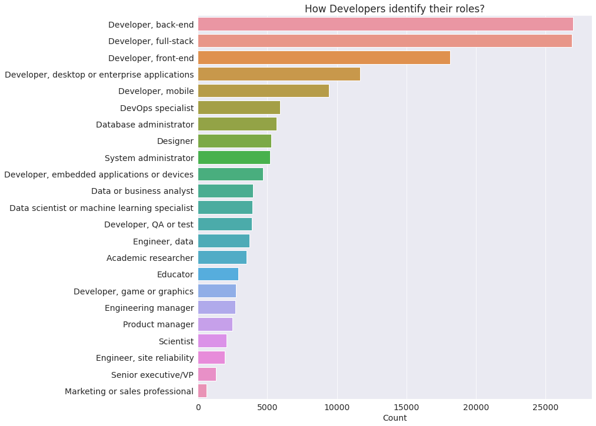
    


As one might expect, the most common roles include "Developer" in the name. 

## Asking and Answering Questions

We've already gained several insights about the respondents and the programming community by exploring individual columns of the dataset. Let's ask some specific questions and try to answer them using data frame operations and visualizations.

### Q: What are the most popular programming languages in 2020? 

To answer, this we can use the `LanguageWorkedWith` column. Similar to `DevType`, respondents were allowed to choose multiple options here.


```python
survey_df.LanguageWorkedWith
```


    0                                   C#;HTML/CSS;JavaScript
    1                                         JavaScript;Swift
    2                                 Objective-C;Python;Swift
    3                                                      NaN
    4                                        HTML/CSS;Ruby;SQL
                                   ...                        
    64456                                                  NaN
    64457    Assembly;Bash/Shell/PowerShell;C;C#;C++;Dart;G...
    64458                                                  NaN
    64459                                             HTML/CSS
    64460                      C#;HTML/CSS;Java;JavaScript;SQL
    Name: LanguageWorkedWith, Length: 64291, dtype: object


```python
languages_worked_df = split_multicolumn(survey_df.LanguageWorkedWith)
languages_worked_df
```


<div>
<style scoped>
    .dataframe tbody tr th:only-of-type {
        vertical-align: middle;
    }

    .dataframe tbody tr th {
        vertical-align: top;
    }

    .dataframe thead th {
        text-align: right;
    }
</style>
<table border="1" class="dataframe">
  <thead>
    <tr style="text-align: right;">
      <th></th>
      <th>C#</th>
      <th>HTML/CSS</th>
      <th>JavaScript</th>
      <th>Swift</th>
      <th>Objective-C</th>
      <th>Python</th>
      <th>Ruby</th>
      <th>SQL</th>
      <th>Java</th>
      <th>PHP</th>
      <th>...</th>
      <th>VBA</th>
      <th>Perl</th>
      <th>Scala</th>
      <th>C++</th>
      <th>Go</th>
      <th>Haskell</th>
      <th>Rust</th>
      <th>Dart</th>
      <th>Julia</th>
      <th>Assembly</th>
    </tr>
  </thead>
  <tbody>
    <tr>
      <th>0</th>
      <td>True</td>
      <td>True</td>
      <td>True</td>
      <td>False</td>
      <td>False</td>
      <td>False</td>
      <td>False</td>
      <td>False</td>
      <td>False</td>
      <td>False</td>
      <td>...</td>
      <td>False</td>
      <td>False</td>
      <td>False</td>
      <td>False</td>
      <td>False</td>
      <td>False</td>
      <td>False</td>
      <td>False</td>
      <td>False</td>
      <td>False</td>
    </tr>
    <tr>
      <th>1</th>
      <td>False</td>
      <td>False</td>
      <td>True</td>
      <td>True</td>
      <td>False</td>
      <td>False</td>
      <td>False</td>
      <td>False</td>
      <td>False</td>
      <td>False</td>
      <td>...</td>
      <td>False</td>
      <td>False</td>
      <td>False</td>
      <td>False</td>
      <td>False</td>
      <td>False</td>
      <td>False</td>
      <td>False</td>
      <td>False</td>
      <td>False</td>
    </tr>
    <tr>
      <th>2</th>
      <td>False</td>
      <td>False</td>
      <td>False</td>
      <td>True</td>
      <td>True</td>
      <td>True</td>
      <td>False</td>
      <td>False</td>
      <td>False</td>
      <td>False</td>
      <td>...</td>
      <td>False</td>
      <td>False</td>
      <td>False</td>
      <td>False</td>
      <td>False</td>
      <td>False</td>
      <td>False</td>
      <td>False</td>
      <td>False</td>
      <td>False</td>
    </tr>
    <tr>
      <th>3</th>
      <td>False</td>
      <td>False</td>
      <td>False</td>
      <td>False</td>
      <td>False</td>
      <td>False</td>
      <td>False</td>
      <td>False</td>
      <td>False</td>
      <td>False</td>
      <td>...</td>
      <td>False</td>
      <td>False</td>
      <td>False</td>
      <td>False</td>
      <td>False</td>
      <td>False</td>
      <td>False</td>
      <td>False</td>
      <td>False</td>
      <td>False</td>
    </tr>
    <tr>
      <th>4</th>
      <td>False</td>
      <td>True</td>
      <td>False</td>
      <td>False</td>
      <td>False</td>
      <td>False</td>
      <td>True</td>
      <td>True</td>
      <td>False</td>
      <td>False</td>
      <td>...</td>
      <td>False</td>
      <td>False</td>
      <td>False</td>
      <td>False</td>
      <td>False</td>
      <td>False</td>
      <td>False</td>
      <td>False</td>
      <td>False</td>
      <td>False</td>
    </tr>
    <tr>
      <th>...</th>
      <td>...</td>
      <td>...</td>
      <td>...</td>
      <td>...</td>
      <td>...</td>
      <td>...</td>
      <td>...</td>
      <td>...</td>
      <td>...</td>
      <td>...</td>
      <td>...</td>
      <td>...</td>
      <td>...</td>
      <td>...</td>
      <td>...</td>
      <td>...</td>
      <td>...</td>
      <td>...</td>
      <td>...</td>
      <td>...</td>
      <td>...</td>
    </tr>
    <tr>
      <th>64456</th>
      <td>False</td>
      <td>False</td>
      <td>False</td>
      <td>False</td>
      <td>False</td>
      <td>False</td>
      <td>False</td>
      <td>False</td>
      <td>False</td>
      <td>False</td>
      <td>...</td>
      <td>False</td>
      <td>False</td>
      <td>False</td>
      <td>False</td>
      <td>False</td>
      <td>False</td>
      <td>False</td>
      <td>False</td>
      <td>False</td>
      <td>False</td>
    </tr>
    <tr>
      <th>64457</th>
      <td>True</td>
      <td>True</td>
      <td>True</td>
      <td>True</td>
      <td>True</td>
      <td>True</td>
      <td>True</td>
      <td>True</td>
      <td>True</td>
      <td>True</td>
      <td>...</td>
      <td>True</td>
      <td>True</td>
      <td>True</td>
      <td>True</td>
      <td>True</td>
      <td>True</td>
      <td>True</td>
      <td>True</td>
      <td>True</td>
      <td>True</td>
    </tr>
    <tr>
      <th>64458</th>
      <td>False</td>
      <td>False</td>
      <td>False</td>
      <td>False</td>
      <td>False</td>
      <td>False</td>
      <td>False</td>
      <td>False</td>
      <td>False</td>
      <td>False</td>
      <td>...</td>
      <td>False</td>
      <td>False</td>
      <td>False</td>
      <td>False</td>
      <td>False</td>
      <td>False</td>
      <td>False</td>
      <td>False</td>
      <td>False</td>
      <td>False</td>
    </tr>
    <tr>
      <th>64459</th>
      <td>False</td>
      <td>True</td>
      <td>False</td>
      <td>False</td>
      <td>False</td>
      <td>False</td>
      <td>False</td>
      <td>False</td>
      <td>False</td>
      <td>False</td>
      <td>...</td>
      <td>False</td>
      <td>False</td>
      <td>False</td>
      <td>False</td>
      <td>False</td>
      <td>False</td>
      <td>False</td>
      <td>False</td>
      <td>False</td>
      <td>False</td>
    </tr>
    <tr>
      <th>64460</th>
      <td>True</td>
      <td>True</td>
      <td>True</td>
      <td>False</td>
      <td>False</td>
      <td>False</td>
      <td>False</td>
      <td>True</td>
      <td>True</td>
      <td>False</td>
      <td>...</td>
      <td>False</td>
      <td>False</td>
      <td>False</td>
      <td>False</td>
      <td>False</td>
      <td>False</td>
      <td>False</td>
      <td>False</td>
      <td>False</td>
      <td>False</td>
    </tr>
  </tbody>
</table>
<p>64291 rows × 25 columns</p>
</div>


It appears that a total of 25 languages were included among the options. Let's aggregate these to identify the percentage of respondents who selected each language.


```python
languages_worked_pct = languages_worked_df.mean().sort_values(ascending=False) * 100
languages_worked_pct
```


    JavaScript               59.896409
    HTML/CSS                 55.805634
    SQL                      48.445350
    Python                   39.002349
    Java                     35.620849
    Bash/Shell/PowerShell    29.240485
    C#                       27.801714
    PHP                      23.126099
    TypeScript               22.463486
    C++                      21.111820
    C                        19.234419
    Go                        7.756918
    Kotlin                    6.885878
    Ruby                      6.223266
    Assembly                  5.442441
    VBA                       5.389557
    Swift                     5.224682
    R                         5.059806
    Rust                      4.496741
    Objective-C               3.600815
    Dart                      3.513711
    Scala                     3.148186
    Perl                      2.754662
    Haskell                   1.858736
    Julia                     0.779269
    dtype: float64


We can plot this information using a horizontal bar chart.


```python
plt.figure(figsize=(12, 12))
sns.barplot(x=languages_worked_pct, y=languages_worked_pct.index)
plt.title("Languages used in the past year");
plt.xlabel('Percentage');
```


    
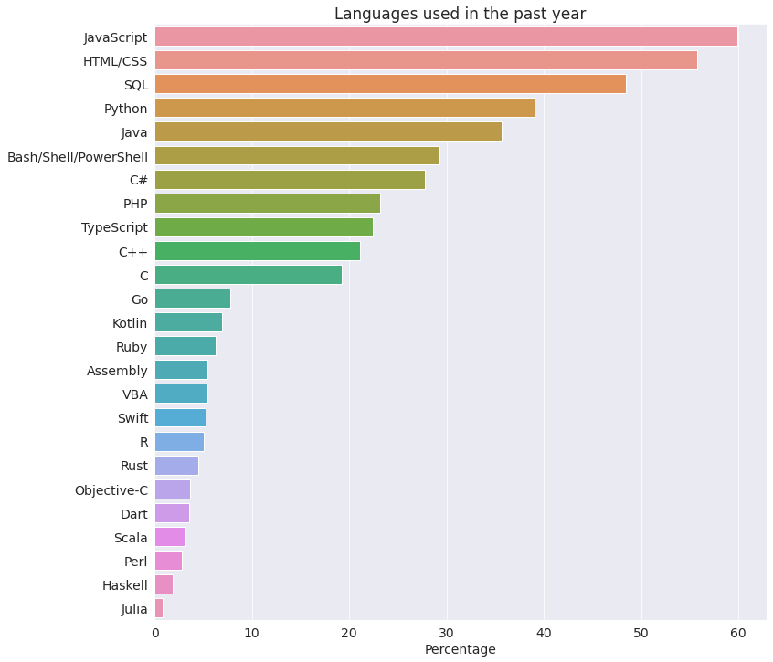
    


Perhaps unsurprisingly, Javascript & HTML/CSS comes out at the top as web development is one of today's most sought skills. It also happens to be one of the easiest to get started. SQL is necessary for working with relational databases, so it's no surprise that most programmers work with SQL regularly. Python seems to be the popular choice for other forms of development, beating out Java, which was the industry standard for server & application development for over two decades.

### Q: Which languages are the most people interested to learn over the next year?

For this, we can use the `LanguageDesireNextYear` column, with similar processing as the previous one.


```python
languages_interested_df = split_multicolumn(survey_df.LanguageDesireNextYear)
languages_interested_pct = languages_interested_df.mean().sort_values(ascending=False) * 100
languages_interested_pct
```


    Python                   41.150394
    JavaScript               40.430231
    HTML/CSS                 32.032477
    SQL                      30.803689
    TypeScript               26.456269
    C#                       21.060491
    Java                     20.464762
    Go                       19.433513
    Bash/Shell/PowerShell    18.058515
    Rust                     16.271329
    C++                      15.014543
    Kotlin                   14.761009
    PHP                      10.945544
    C                         9.362119
    Swift                     8.693285
    Dart                      7.308955
    R                         6.571682
    Ruby                      6.423916
    Scala                     5.327340
    Haskell                   4.594733
    Assembly                  3.767246
    Julia                     2.541569
    Objective-C               2.339363
    Perl                      1.760744
    VBA                       1.608312
    dtype: float64


```python
plt.figure(figsize=(12, 12))
sns.barplot(x=languages_interested_pct, y=languages_interested_pct.index)
plt.title("Languages people are intersted in learning over the next year");
plt.xlabel('Percentage');
```


    
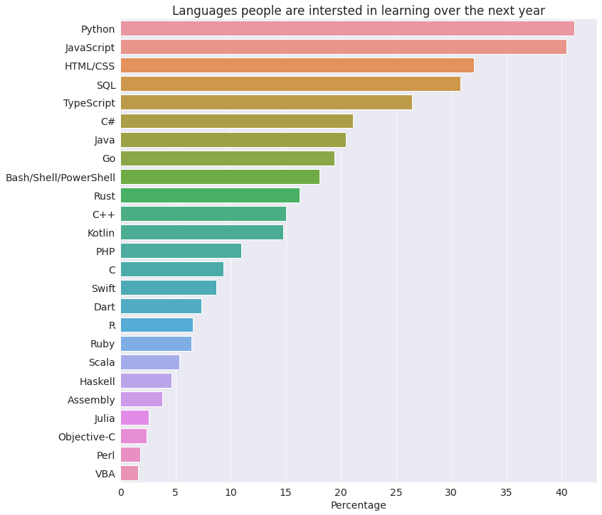
    


Once again, it's not surprising that Python is the language most people are interested in learning - since it is an easy-to-learn general-purpose programming language well suited for a variety of domains: application development, numerical computing, data analysis, machine learning, big data, cloud automation, web scraping, scripting, etc. We're using Python for this very analysis, so we're in good company!

### Q:  Which are the most loved languages, i.e., a high percentage of people who have used the language want to continue learning & using it over the next year?

While this question may seem tricky at first, it's straightforward to solve using Pandas array operations. Here's what we can do:

- Create a new data frame `languages_loved_df` that contains a `True` value for a language only if the corresponding values in `languages_worked_df` and `languages_interested_df` are both `True`
- Take the column-wise sum of `languages_loved_df` and divide it by the column-wise sum of `languages_worked_df` to get the percentage of respondents who "love" the language
- Sort the results in decreasing order and plot a horizontal bar graph


```python
languages_loved_df = languages_worked_df & languages_interested_df
```


```python
languages_loved_pct = (languages_loved_df.sum() * 100/ languages_worked_df.sum()).sort_values(ascending=False)
```


```python
plt.figure(figsize=(12, 12))
sns.barplot(x=languages_loved_pct, y=languages_loved_pct.index)
plt.title("Most loved languages")
plt.xlabel('Percentage');
```


    
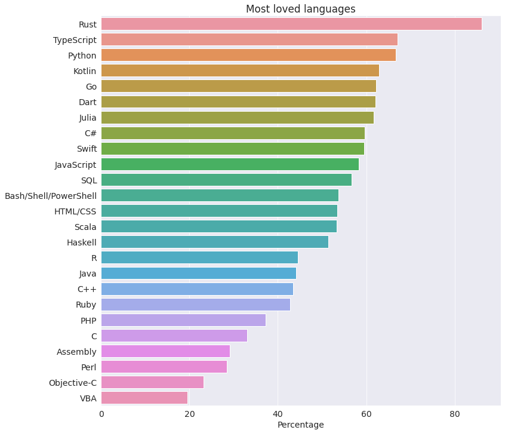
    


Rust has been StackOverflow's most-loved language for four years in a row. The second most-loved language is TypeScript, a popular alternative to JavaScript for web development.

Python features at number 3, despite already being one of the most widely-used languages in the world. Python has a solid foundation, is easy to learn & use, has a large ecosystem of domain-specific libraries, and a massive worldwide community.

### Q: In which countries do developers work the highest number of hours per week? Consider countries with more than 250 responses only.

To answer this question, we'll need to use the `groupby` data frame method to aggregate the rows for each country. We'll also need to filter the results to only include the countries with more than 250 respondents.


```python
countries_df = survey_df.groupby('Country')[['WorkWeekHrs']].mean().sort_values('WorkWeekHrs', ascending=False)
```


```python
h_response_countries_df = countries_df.loc[survey_df.Country.value_counts() > 250].head(15)
h_response_countries_df
```


<div>
<style scoped>
    .dataframe tbody tr th:only-of-type {
        vertical-align: middle;
    }

    .dataframe tbody tr th {
        vertical-align: top;
    }

    .dataframe thead th {
        text-align: right;
    }
</style>
<table border="1" class="dataframe">
  <thead>
    <tr style="text-align: right;">
      <th></th>
      <th>WorkWeekHrs</th>
    </tr>
    <tr>
      <th>Country</th>
      <th></th>
    </tr>
  </thead>
  <tbody>
    <tr>
      <th>Iran</th>
      <td>44.337748</td>
    </tr>
    <tr>
      <th>Israel</th>
      <td>43.915094</td>
    </tr>
    <tr>
      <th>China</th>
      <td>42.150000</td>
    </tr>
    <tr>
      <th>United States</th>
      <td>41.799858</td>
    </tr>
    <tr>
      <th>Greece</th>
      <td>41.402724</td>
    </tr>
    <tr>
      <th>Viet Nam</th>
      <td>41.391667</td>
    </tr>
    <tr>
      <th>South Africa</th>
      <td>41.023460</td>
    </tr>
    <tr>
      <th>Turkey</th>
      <td>40.982143</td>
    </tr>
    <tr>
      <th>Sri Lanka</th>
      <td>40.612245</td>
    </tr>
    <tr>
      <th>New Zealand</th>
      <td>40.457551</td>
    </tr>
    <tr>
      <th>Belgium</th>
      <td>40.444444</td>
    </tr>
    <tr>
      <th>Canada</th>
      <td>40.208837</td>
    </tr>
    <tr>
      <th>Hungary</th>
      <td>40.194340</td>
    </tr>
    <tr>
      <th>India</th>
      <td>40.100349</td>
    </tr>
    <tr>
      <th>Bangladesh</th>
      <td>40.097458</td>
    </tr>
  </tbody>
</table>
</div>


```python
h_response_countries_df.plot(kind='bar')
plt.title('which countries do developers work the highest number of hours per week?')
plt.xticks(rotation=75);
```


    
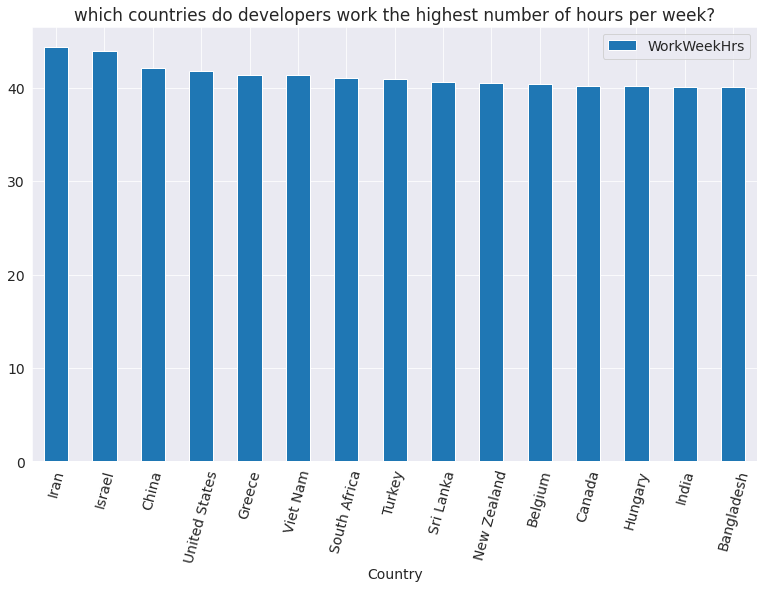
    


The Asian countries like Iran, China, and Israel have the highest working hours, followed by the United States. However, there isn't too much variation overall, and the average working hours seem to be around 40 hours per week.

### Q: How important is it to start young to build a career in programming?

Let's create a scatter plot of `Age` vs. `YearsCodePro` (i.e., years of coding experience) to answer this question.


```python
schema.YearsCodePro
```


    'NOT including education, how many years have you coded professionally (as a part of your work)?'


```python
sns.scatterplot(x='Age', y='YearsCodePro', hue='Hobbyist', data=survey_df)
plt.xlabel("Age")
plt.ylabel("Years of professional coding experience");
```


    
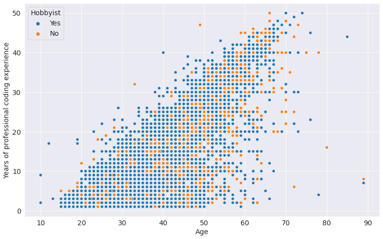
    


You can see points all over the graph, which indicates that you can start programming professionally at any age. Many people who have been coding for several decades professionally also seem to enjoy it as a hobby.

We can also view the distribution of the Age1stCode column to see when the respondents tried programming for the first time.


```python
plt.title(schema.Age1stCode)
ax = sns.histplot(x=survey_df.Age1stCode, bins=30, kde=True);
ax.lines[0].set_color('crimson');
```


    
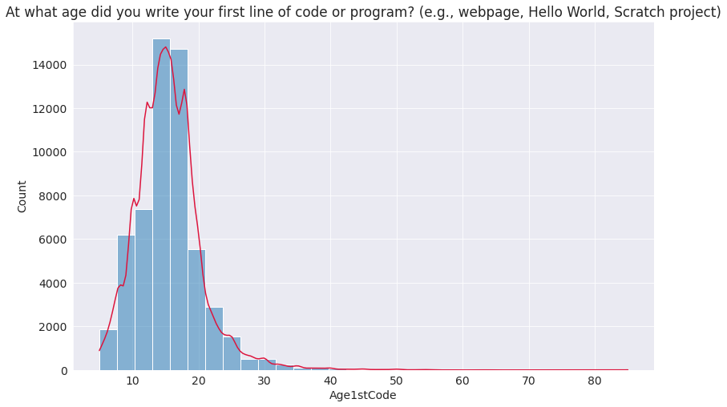
    


As you might expect, most people seem to have had some exposure to programming before the age of 40. However, but there are people of all ages and walks of life learning to code.

## summary

We've drawn many inferences from the survey. Here's a summary of a few of them:

- Based on the survey respondents' demographics, we can infer that the survey is somewhat representative of the overall programming community. However, it has fewer responses from programmers in non-English-speaking countries and women & non-binary genders.

- The programming community is not as diverse as it can be. Although things are improving, we should make more efforts to support & encourage underrepresented communities, whether in terms of age, country, race, gender, or otherwise.


- Although most programmers hold a college degree, a reasonably large percentage did not have computer science as their college major. Hence, a computer science degree isn't compulsory for learning to code or building a career in programming.

- A significant percentage of programmers either work part-time or as freelancers, which can be a great way to break into the field, especially when you're just getting started.

- Javascript & HTML/CSS are the most used programming languages in 2020, closely followed by SQL & Python.

- Python is the language most people are interested in learning - since it is an easy-to-learn general-purpose programming language well suited for various domains.

- Rust and TypeScript are the most "loved" languages in 2020, both of which have small but fast-growing communities. Python is a close third, despite already being a widely used language.

- Programmers worldwide seem to be working for around 40 hours a week on average, with slight variations by country.

- You can learn and start programming professionally at any age. You're likely to have a long and fulfilling career if you also enjoy programming as a hobby.

